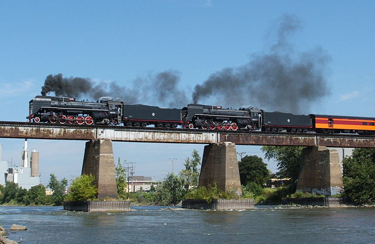
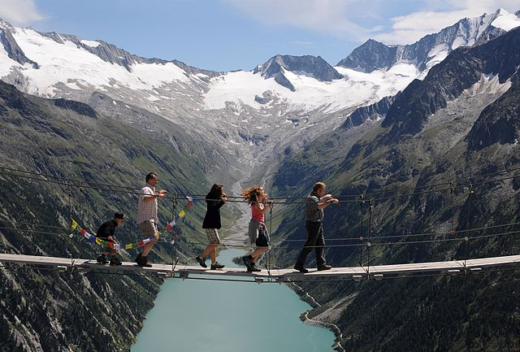
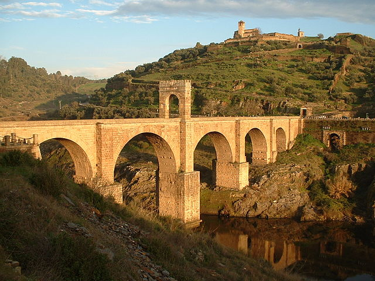
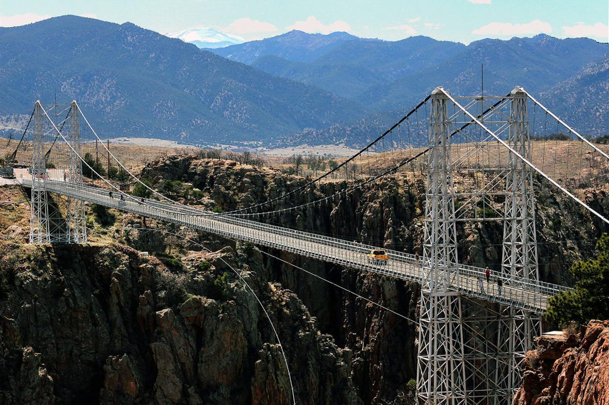

import { Split } from 'mdx-deck/layouts.js';

# Bridges

---

export default Split;

## Beam bridge

Simplest kind of bridge, identified by their simple design and no built-in support

Also known as stringer bridges

Rarely span over 250 feet without piers for support

---

export default Split;

## Simple suspension bridge

Supported entirely from anchors at either end, no towers or piers. Identifiable by its arc

Also called rope bridge or catenary bridge

---

export default Split;

## Arch bridge

Identifiable via its distinctive arch, which transfers weight at the center to either side

Popular in ancient Rome, notably used to build the aqueducts

---

export default Split;

## Suspension bridge

Identifiable by cables suspended between towers which carry the weight of the deck below

More advanced version of simple suspension bridge

Many popular examples, including Golden Gate Bridge, Manhattan Bridge, and George Washington Bridge

