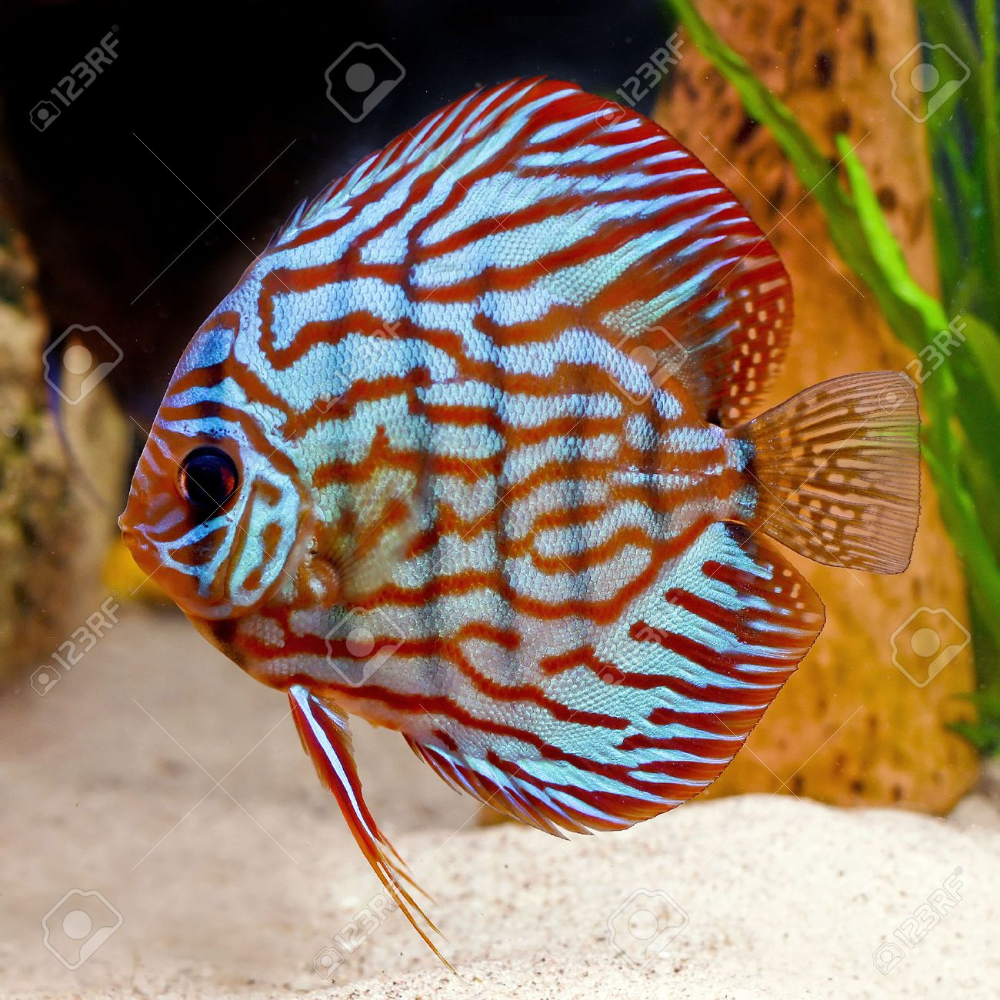
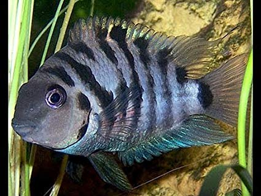

import { Split } from 'mdx-deck/layouts.js';

# Fish

---

export default Split;



## Discus

_Symphysodon discus_

Can be recognized by their _disc_-like shape due to their large rounded fins and narrow bodies

Sometimes referred to as **pomadour fish**


---

export default Split;


## Blue tang

_Paracanthurus hepatus_

Can be recognized by their deep blue bodies with black palettes and yellow tails

A species of surgeonfish with many alternative common names


---

export default Split;



## Convict cichlid

_Amatitlania nigrofasciata_

Can be recognized by having 8 or 9 vertical black bars on a blue-grey body and a dark blotch on their gill region

Also known as zebra cichlid


---

export default Split;


## Clownfish

Can be recognized by its vibrant orange body and large white bands, with small black separators between them

A type of anemonefish, they are immune to sea anemone's poison and use them as nests

```notes
I had to look up Nemo's dad's name. It's Marlin.
```

_Amphiprion ocellaris_


